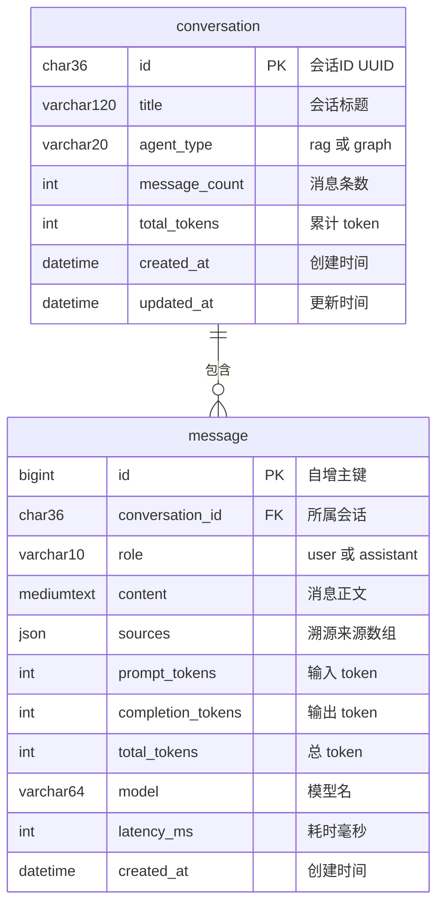

# Agentic RAG 医疗智能问答系统 · 系统设计

| 项目 | 内容 |
| --- | --- |
| 文档版本 | v0.5（初稿，待评审） |
| 编制日期 | 2026-09-19 |
| 对应阶段 | 软件开发流程 · 第 2 章「系统设计」 |
| 上游文档 | `需求分析.md` v0.3（F1-F9 功能定义） |
| 关联文档 | `接口文档.md` v1.2（开发阶段的接口规范） |
| 设计对象 | `agentic-r/` 工程（前后端分离：`backend/` + `frontend/`） |
| 本文档回答 | 怎么做 —— 架构、选型、数据、接口、界面 |

---

## 0. 设计说明

本文档把 `需求分析.md` 中的 9 项功能需求翻译成可施工的技术蓝图。设计遵循三条原则：

1. **不推倒重来**：智能体骨架、文档检索与图谱查询两条能力链路、流式输出已跑通，本次是在既有分层上做增强。唯一例外是前端（需求已确认重做）。
2. **契约先行**：接口与流式协议先定死，前后端才能并行开发。
3. **每个决策留痕**：关键取舍记在 §6 的 ADR 里，包含「代价」一栏 —— 设计没有免费的选项。

---

## 1. 架构设计

### 1.1 架构选型：分层单体（Layered Monolith）

**决策**：采用分层单体架构，**不使用微服务**。

**理由**：

| 维度 | 判断 |
| --- | --- |
| 部署规模 | 单机单用户运行，无独立扩缩容需求 |
| 工期 | 3-5 天。微服务带来的服务发现、网关、链路追踪、分布式事务成本，在这里换不来任何收益 |
| 数据一致性 | 会话与消息写入需要事务，单体天然保证；拆成服务反而要处理分布式事务 |
| 可维护性 | 通过**代码分层**而非**进程拆分**来隔离关注点，同样能获得清晰边界 |
| 演进空间 | 若未来要拆，现有分层边界可直接映射为服务边界，不留技术债 |

**代价**：所有模块共享同一进程，一个模块的阻塞（如 DashScope 重排网络往返）会占用事件循环。**缓解措施**：接口层全程 `async`，所有外部调用（Ollama / Neo4j / MySQL / DashScope）都走异步或线程池，不阻塞主循环。

### 1.2 分层职责

```
展示层     frontend/            React SPA · 流式渲染 · 溯源卡片 · 语音输入
   ↓ HTTP / NDJSON
接口层     api/chat_api.py      FastAPI · 协议转换 · 会话 CRUD · 落库
   ↓
智能体层   agent/               LangGraph 状态图 · 工具编排 · 记忆
   ↓                    ↘
工具层     tools/        模型层  llm/
   ↓                    ↙
数据层     FAISS · BM25 · Neo4j · MySQL
   ↓
基础设施层 utils/paths.py       路径与配置的单一真相源
```

| 层 | 职责 | 不该做的事 |
| --- | --- | --- |
| 展示层 | 渲染、交互、本地状态 | 不拼业务逻辑，不直连数据库 |
| 接口层 | 参数校验、协议转换、持久化编排、错误映射 | 不写检索算法，不写提示词 |
| 智能体层 | 决定「调哪个工具、调几次」 | 不关心 HTTP，不直接访问数据库 |
| 工具层 | 单一能力封装（检索、查询） | 不做多步编排，不持有会话状态 |
| 模型层 | 模型客户端与调用参数 | 不含业务判断 |
| 数据层 | 存储与检索 | 不含业务逻辑 |
| 基础设施层 | 路径、环境变量、语料注册 | 不含任何业务语义 |

**约束**：依赖只能自上而下单向流动。工具层不得反向 import 接口层；任何模块不得绕过 `utils/paths.py` 自己拼路径或加载 `.env`。

### 1.3 组件交互时序

一次完整问答的调用链（对应 §4.3 的流式协议）：

```
前端          接口层          智能体层         数据层
 │              │                │                │
 │─POST /api/ask→                │                │
 │              │─astream(question, thread_id)──→ │
 │              │                │─混合检索 + Cypher→│
 │              │                │←─候选文档 + 来源─│
 │              │←──流式 yield 文本增量───────────│
 │←─NDJSON c/s/u─                │                │
 │              │─写入 message（溯源 + token）────→│
```

**七步说明**：

| 步骤 | 动作 | 关键点 |
| --- | --- | --- |
| 1 | 前端 `POST /api/ask` | 携带 `question` 与 `conversation_id`（新会话为 `null`） |
| 2 | 接口层调 `stream_agent()` | `thread_id` 即会话 ID，供 `MemorySaver` 定位上下文 |
| 3 | 智能体层调工具 | `/api/ask` 仅调用 `retrieve_context`；`/api/ask_graph` 仅调用 `cypher_tool` |
| 4 | 工具返回结构化结果 | **含 `sources`** —— 这是 F4 的源头 |
| 5 | 智能体流式回传 | 正文增量 + 状态里的 `sources` |
| 6 | 接口层组装 NDJSON | `c` 逐块下发，结束后补 `s` 与 `u` |
| 7 | 接口层落库 | 写入 assistant 消息，含溯源与 token |

**关键设计**：步骤 6 中，溯源（`s`）与用量（`u`）**搭在原有内容流尾部下发**，不新开接口。现有前端的解析器只认 `c` 和 `err`，对未知字段静默忽略 —— 因此这次协议扩展**不需要改动任何既有解析逻辑**，属于向后兼容扩展。

### 1.4 部署视图

**开发期**（前后端分离，热更新）：

```
终端 1  Ollama                        127.0.0.1:11434   常驻
终端 2  Neo4j Desktop 实例 Agent_RAG   127.0.0.1:7687    手动启动
终端 3  MySQL（brew services）         127.0.0.1:3306    常驻
终端 4  cd backend && uvicorn api.chat_api:app --reload   127.0.0.1:8000
终端 5  cd frontend && npm run dev                        127.0.0.1:5173  代理 /api → 8000
```

**演示期**（单端口，避免演示时开一堆终端）：

```
cd frontend && npm run build        →  frontend/dist
backend/api/chat_api.py 中挂载静态目录：
    FRONTEND_DIST = PROJECT_ROOT.parent / "frontend" / "dist"
    app.mount("/", StaticFiles(directory=FRONTEND_DIST, html=True))
访问 http://127.0.0.1:8000
```

> **注意静态目录的路径写法**：前后端分离后 `backend/` 是 Python 的项目根，而 `frontend/dist` 在它的**兄弟目录**下。因此**不能**写成相对路径 `"frontend/dist"`（那会解析成 `backend/frontend/dist`，不存在）。正确做法是用 `PROJECT_ROOT.parent / "frontend" / "dist"` 算出绝对路径 —— 与全项目「路径由 `utils/paths.py` 统一推导」的约定保持一致。

单端口部署的好处：无跨域配置、无代理、一条命令起服务，答辩时不容易翻车。

### 1.5 检索链路设计（F3）

这是本次技术含量最高的部分。改造前的 `rag_tool` 是**单路稠密检索**，中文短查询与专有名词（药名、检查项）召回差。改造后为三段式：

```
                     query
          ┌────────────┴────────────┐
     jieba 分词                 nomic-embed
          ↓                         ↓
   BM25（rank_bm25）          FAISS 向量检索
     top 20 (稀疏)              top 20 (稠密)
          └────────────┬────────────┘
                       ↓
              RRF 融合（k=60）→ top 20
                       ↓
        DashScope gte-rerank 精排 → top 5
                       ↓
              结构化 content + sources
```

**RRF 融合公式**：

```
score(d) = Σ  1 / (k + rank_i(d))
          i∈通道
```

`k` 取 60（业界常用值）。选 RRF 而非加权求和的原因：**BM25 分与余弦相似度量纲不可比**，加权求和需要归一化，而归一化参数又要靠调参；RRF 只用排名不用分值，天然免调参。

**重排的必要性**：RRF 融合只利用了排名信息，对「哪条更相关」的判断是粗粒度的。交叉编码器（cross-encoder）重排模型能逐条精读「问题 × 文档」对，精度显著更高。代价是候选集每条都要打一次分，因此**只对融合后的 top 20 做重排**，而不是对全库。

**降级策略**：重排服务不可用时（网络不通、额度耗尽、未开通权限），直接返回 RRF 融合结果。**链路不中断，只降精度** —— 这是需求分析 §3.3 假设 5 的落地。

**索引侧配套改造**：`utils/rag_index.py` 目前只产出 FAISS 索引。BM25 需要原始语料分块，因此必须**同时落盘一份 chunks + metadata**：

```
faiss-index/medical/
├── index.faiss
├── index.pkl
└── bm25_corpus.pkl     ← 新增：分块后的文本与元数据，供 BM25 建索引
```

**可配置参数**（写入 `.env`，避免硬编码）：

| 参数 | 默认值 | 说明 |
| --- | --- | --- |
| `RETRIEVAL_DENSE_TOP_K` | 20 | 稠密通道召回数 |
| `RETRIEVAL_SPARSE_TOP_K` | 20 | 稀疏通道召回数 |
| `RETRIEVAL_RRF_K` | 60 | RRF 平滑常数 |
| `RETRIEVAL_FUSION_TOP_K` | 20 | 融合后送重排的候选数 |
| `RERANK_ENABLED` | true | 重排开关（关闭即降级） |
| `RERANK_MODEL` | gte-rerank-v2 | 重排模型名 |
| `RERANK_TOP_N` | 5 | 最终返回条数 |

### 1.6 溯源数据流设计（F4）

F4 是贯穿四层改动最深的一项。核心问题是：**来源信息在工具返回的那一刻就被丢掉了** —— `retrieve_context` 把 3 段文本拼成一个字符串，`cypher_tool` 的 `dict` 也没被智能体保留。

**改造方案**：让来源信息全程随数据流动。

```
工具层          →   智能体层          →   接口层        →   前端
返回结构化对象      收集进 state.sources   组装 s 事件      渲染溯源卡片
{content, sources}  Annotated[list, add]  {"s":[...]}     SourceCard 组件
```

**Source 对象结构**：

```json
{
  "type": "vector",
  "name": "百日咳",
  "score": 0.83,
  "snippet": "【预防】百日咳可通过接种疫苗预防…",
  "meta": {
    "channel": "hybrid",
    "rerank_score": 0.83,
    "dense_rank": 2,
    "sparse_rank": 5
  }
}
```

```json
{
  "type": "graph",
  "name": "Disease:百日咳 → DISEASE_SYMPTOM → Symptom",
  "score": null,
  "snippet": "命中症状 7 条",
  "meta": {
    "cypher": "MATCH (d:Disease {name:'百日咳'})-[:DISEASE_SYMPTOM]->(s) RETURN s.name",
    "row_count": 7
  }
}
```

**`meta` 保留中间过程**的价值：演示时能说清「这条答案为什么排第一」—— 稠密排第 2、稀疏排第 5、融合后进重排、最终得分 0.83。这是把黑箱变白箱的关键，也是答辩时最有说服力的材料。

**状态字段定义**：

```python
class AgentState(TypedDict):
    messages: Annotated[list[AnyMessage], add_messages]
    sources: Annotated[list[dict], operator.add]   # 新增：多轮工具调用自动累积
```

用 `operator.add` 作为 reducer，是因为一轮问答可能调用工具多次（比如先查图谱再补向量检索），每次都要把来源追加而不是覆盖。

### 1.7 记忆与持久化设计（F2 + F7）

**目标行为**：用户在左侧点击任意历史会话，能**直接接着聊**，且模型**记得住前文的问答结果**。

#### 1.7.1 上下文的载体：一个 messages 列表

LangGraph 的 `AgentState.messages` 就是「存储对话上下文的列表」：

```python
class AgentState(TypedDict):
    messages: Annotated[list[AnyMessage], add_messages]   # ← 对话上下文列表
    sources: Annotated[list[dict], operator.add]
```

`add_messages` 是 **reducer** —— 节点返回的新消息会被**追加**而非覆盖，所以这个列表随对话自然增长，无需手工维护。

#### 1.7.2 职责切分

| | F2 内存级记忆 | F7 历史对话入库 |
| --- | --- | --- |
| 载体 | LangGraph `MemorySaver`（进程内存） | MySQL `agentic_rag` 库 |
| 生命周期 | 进程存活期，重启即失 | 永久 |
| 用途 | 多轮上下文（「那能吃什么」能接上「百日咳」） | 会话列表、历史回看、token 归档 |
| 读取时机 | 每次 `astream` 自动 | **仅冷启动回灌时读一次** |

#### 1.7.3 两条路径

```
POST /api/ask（带 conversation_id，即 thread_id）
        ↓
  checkpointer 里有该 thread 吗？
   ├── 有（热路径）→ 直接用内存中的 messages 列表，零数据库开销
   └── 无（冷启动）→ 从 MySQL 读全部历史 → 一次性回灌 → 再用
        ↓
  拼装 messages = [SystemPrompt] + 历史 + 新问题 → 跑 agent → 流式回答 → 落库
```

**热路径**覆盖同一会话的连续多轮提问；**冷路径**只在「进程重启后首次打开某会话」时触发一次，之后该会话回到热路径。

#### 1.7.4 判断与回灌的实现

```python
MAX_CONTEXT_MESSAGES = 50   # 回灌上限，防止超长会话拖垮上下文窗口

def ensure_context(graph, repo, conversation_id: str) -> None:
    """确保 checkpointer 中有该会话的上下文；没有则从 MySQL 回灌。"""
    config = {"configurable": {"thread_id": conversation_id}}

    # get_state 返回当前状态快照；messages 非空说明上下文已在内存中
    snapshot = graph.get_state(config)
    if snapshot.values.get("messages"):
        return                                    # 热路径：直接返回

    # 冷路径：从 MySQL 读历史，一次性回灌
    history = repo.get_messages(conversation_id, limit=MAX_CONTEXT_MESSAGES)
    if not history:
        return
    graph.update_state(
        config,
        {"messages": [to_lc_message(m) for m in history]},   # 一次性传入
    )

def to_lc_message(m) -> HumanMessage | AIMessage:
    """业务消息 → LangChain 消息。只映射 user / assistant 两类。"""
    if m.role == "user":
        return HumanMessage(content=m.content)
    return AIMessage(content=m.content)
```

> **`update_state` 必须一次性传入全部消息**，不能写成 `for msg in history: graph.update_state(...)`。
> 因为 `add_messages` 是 reducer，循环调用会**触发多次 checkpoint 写入**，既慢又会在 checkpointer 里
> 堆积大量中间快照。

#### 1.7.5 只回灌 user / assistant，不回灌工具消息

这是个刻意的取舍：

| | 存工具消息 | 只存 user / assistant（**选中**） |
| --- | --- | --- |
| 表结构 | 需增加 `tool_call_id`、`tool_name` 等字段 | 沿用现有 `role: user \| assistant` |
| 前端渲染 | 需过滤掉工具调用，否则用户看到一堆 JSON | 直接渲染 |
| 上下文价值 | 模型能「看到」上轮查过什么 | 模型看不到，但**重新检索一次成本很低** |

关键理由：上一轮的**最终回答里已经包含实体名**（如「百日咳的常见症状包括…」），模型据此足以理解
「那能吃什么」在问什么。工具调用过程属于实现细节，没必要进上下文。

#### 1.7.6 上下文窗口控制

会话轮次增长会让 `messages` 列表越来越长，最终超出模型上下文窗口。用
`langchain_core.messages.trim_messages` 在**喂给模型之前**裁剪：

```python
from langchain_core.messages import trim_messages

def call_model(state: AgentState):
    history = trim_messages(
        state["messages"],
        max_tokens=MAX_CONTEXT_TOKENS,   # 12000，见下方说明
        strategy="last",                 # 保留最近的消息
        token_counter=count_tokens,      # tiktoken 估算，见下方说明
        include_system=True,
        allow_partial=False,
        start_on="human",                # 保证裁剪后仍从用户提问开始
    )
    messages = [SystemMessage(content=SYSTEM_PROMPT)] + _guard(history, state["messages"])
    return {"messages": [model_with_tools.invoke(messages)]}
```

**裁剪只发生在喂给模型之前** —— checkpointer 里的列表与 MySQL 里的记录都保留完整历史，
用户回看时仍能看到全部对话。

> **实现时修正的两处（初稿给的写法会出问题，务必按下面来）**
>
> **① `token_counter` 不能用模型对象。** 初稿写的 `token_counter=ollama_model` 走的是
> `BaseLanguageModel.get_token_ids()`，需要额外安装 `transformers`；本机未装，实测直接抛
> `ImportError: Could not import transformers`。改用 `tiktoken` 估算（本机已有该依赖）：
>
> ```python
> _ENCODING = tiktoken.get_encoding("cl100k_base")
>
> def count_tokens(messages) -> int:
>     if isinstance(messages, BaseMessage):
>         messages = [messages]
>     return sum(len(_ENCODING.encode(text_of(m))) + 4 for m in messages)
> ```
>
> 只用于「裁到多少条」这个安全阈值，不需要精确，中文按 cl100k 估算的偏差可接受。
>
> **② `max_tokens` 不能取 3000。** 3000 **小于单轮 RAG 问答本身的体量** ——
> 实测一次 `retrieve_context` 返回 5 条资料约 2178 字 ≈ 3000 tokens，光工具结果就占满预算。
> 配合 `allow_partial=False`（整条保留或整条丢弃），裁剪器会从尾部往前一路丢光，
> **连本轮提问一起丢掉**，最终只剩系统提示词：
>
> ```
> agent 第 2 次调用：state 3052 tokens / 3 条 → 裁剪后 1 条 [SystemMessage]
> → 模型答「您好！请问有什么可以帮您」
> ```
>
> 这是**静默失效**：不报错、不告警，表现得像模型能力不行，极难定位。因此：
> - `MAX_CONTEXT_TOKENS` 取 **12000**（qwen3-max 窗口 32k+，约占三分之一）；
> - 另加一道 `_guard()` 兜底 —— 裁剪结果里若没有 `HumanMessage`，
>   就回退为「保留最后一条提问起的全部消息」。
>   **宁可超预算，也不能丢提问**：超预算是可见的（模型会报上下文超限），丢提问是隐形的。

#### 1.7.7 会话删除时同步清理 checkpointer

```python
# DELETE /api/conversations/{conversation_id} 的处理中
checkpointer.delete_thread(conversation_id)
```

不做这一步，被删会话的上下文会变成**幽灵数据**长期占用内存。

#### 1.7.8 已知约束：仅适用于单进程

`MemorySaver` 是**进程内**存储。若 uvicorn 以多 worker 启动（`--workers 2`），同一会话的请求可能落到
不同进程，导致上下文时而命中、时而不命中。

本项目**单 worker 运行**（开发与演示均如此），不受影响。若将来要横向扩展，把 `MemorySaver` 换成
`PostgresSaver` 即可（`langgraph-checkpoint-postgres` 已安装，本机 PostgreSQL 也在运行）—— 但要注意
此时 checkpointer 与 MySQL 成为**两套持久化**，会话删除需同时清理两边。

#### 1.7.9 为什么不用持久化 checkpointer 替代 MySQL

LangGraph 的 checkpoint 表结构是为**状态恢复**设计的（含 `channel_values`、`pending_writes` 等二进制
字段），**不适合直接当作业务数据查询**。前端要展示的「会话列表 + 消息 + 溯源 + token」需要的是干净的
`conversation` / `message` 两张业务表。因此选择：**checkpointer 管状态，MySQL 管业务数据**，各司其职。

---

## 2. 技术选型

### 2.1 选型总表

| 层次 | 选型 | 版本 | 状态 | 选型理由 |
| --- | --- | --- | --- | --- |
| 前端框架 | React + TypeScript | **19** | 新引入 | 需求确认；TS 提供接口契约的类型安全。选用 19 而非 18：项目为全新前端工程，且 shadcn/ui 已完整支持 19 |
| 构建工具 | Vite | 5+ | 新引入 | 冷启动快、配置少；Node 22.22 已就绪 |
| 样式方案 | Tailwind CSS | 3 | 新引入 | 原子化，无样式冲突，适合快速调整 |
| UI 组件 | shadcn/ui（基于 Radix） | — | 新引入 | 组件源码复制进项目，可自由改，不被库版本锁死 |
| Markdown 渲染 | react-markdown + remark-gfm | — | 新引入 | 支持表格、删除线等 GFM 语法 |
| 代码高亮 | highlight.js | — | 沿用 | 现有前端已在用，保持输出一致 |
| **接口类型生成** | **openapi-typescript** | 7.13.0 | 新引入 | 从 `/openapi.json` 自动生成 TS 类型，前端类型不手写（见 `接口文档.md` §8.2） |
| **类型安全客户端** | **openapi-fetch** | 0.17.0 | 新引入 | 轻量（无运行时依赖），泛型直接来自生成的 `paths`；**注意它不支持流式响应**，流式接口仍需原生 `fetch` |
| **服务端状态管理** | **@tanstack/react-query** | 5.103.1 | 新引入 | 会话列表与历史消息的缓存 / 失效 / 重试；流式接口不走它 |
| 后端语言 | Python | 3.12 | 沿用 | 现有工程语言，生态匹配 |
| Web 框架 | FastAPI | 0.116.1 → **建议升 0.141.1** | 已装（建议升级） | 原生 async（流式必需）+ 自动生成 OpenAPI 文档。**接口层尚为空文件，现在是零成本升级窗口** |
| ASGI 服务器 | uvicorn | 0.38.0 → **建议升 0.53.0** | 已装（建议升级） | 与 FastAPI 配套 |
| 智能体编排 | LangGraph | — | 沿用 | 已在用；`MemorySaver` 与状态 reducer 直接支撑 F2/F4 |
| 本地模型 | Ollama + `nomic-embed-text` | — | 沿用（职责收窄） | **仅用于词嵌入**：索引构建与查询编码。问答全部由云端 `qwen3-max` 承担，不做本地降级通道（见 §6 ADR-8） |
| 云端模型 | DashScope qwen3-max | — | 沿用 | 已配置，用于图谱问答与重排 |
| 嵌入模型 | nomic-embed-text | — | 沿用 | 已构建索引 |
| 重排模型 | DashScope gte-rerank | — | 新引入 | 同平台复用凭据，少维护一套鉴权 |
| 向量库 | FAISS | — | 沿用 | 本地、轻量、无服务进程 |
| 稀疏检索 | rank_bm25 + jieba | — | 新引入 | 纯 Python，零服务依赖；jieba 解决中文分词 |
| 图数据库 | Neo4j | 2026.08 | 沿用 | 医疗知识图谱已入库 |
| 关系数据库 | MySQL | 9.6.0 | 新引入 | 本机已运行；需求确认 |
| ORM | SQLAlchemy 2.x + PyMySQL | — | 已装 | 无需新增依赖 |
| 语音识别 | Web Speech API | — | 新引入 | 需求确认「纯前端实现」 |

### 2.2 关键选型对比

**前端：Vite + React 还是 Next.js？**
Next.js 的价值在 SSR 与文件路由，本项目是纯 SPA（无 SEO 需求、无多页路由、无服务端渲染），引入框架只增加构建复杂度。选 Vite。

**UI：shadcn/ui 还是 Ant Design？**
需求确认选 shadcn/ui。代价是气泡、流式光标、会话列表等组件需要自己组装（Ant Design 生态里现成的更多）。收益是**组件源码在项目内**，可以任意改样式，不会被组件库的版本升级与设计语言绑架 —— 对「页面美化」这个需求来说，可塑性比开箱即用更重要。

**稀疏检索：rank_bm25 还是 Elasticsearch？**
ES 的 BM25 实现更工业级，但要跑一个 Java 服务、维护索引同步、写 DSL 查询。本项目语料仅约 3 万块，rank_bm25 全内存加载完全够用，且**零服务依赖** —— 答辩演示时少一个可能挂掉的东西。

**重排：DashScope gte-rerank 还是本地 bge-reranker？**
本地模型无网络依赖、无费用，但需要额外下载模型（数百 MB）并占用显存/内存，且本机已跑着 Ollama + Neo4j + MySQL，资源紧张。选云端：与现有 qwen3-max 共用一套凭据与端点管理，且**重排本身有降级通道**（§1.5）—— 重排不可用时退化为 RRF 融合结果直接返回，链路不中断。

---

## 3. 数据库设计

### 3.1 数据模型



### 3.2 建表 DDL

```sql
CREATE DATABASE IF NOT EXISTS `agentic_rag`
  DEFAULT CHARACTER SET utf8mb4
  DEFAULT COLLATE utf8mb4_0900_ai_ci;

USE `agentic_rag`;

CREATE TABLE IF NOT EXISTS `conversation` (
  `id`            CHAR(36)     NOT NULL                COMMENT '会话ID（UUID v4）',
  `title`         VARCHAR(120) NOT NULL DEFAULT '新会话' COMMENT '会话标题，默认取首条提问前 20 字',
  `agent_type`    VARCHAR(20)  NOT NULL DEFAULT 'rag'   COMMENT '所属智能体：rag | graph',
  `message_count` INT UNSIGNED NOT NULL DEFAULT 0       COMMENT '消息条数（冗余计数，列表页免 COUNT）',
  `total_tokens`  INT UNSIGNED NOT NULL DEFAULT 0       COMMENT '累计 token（冗余，便于成本核算）',
  `created_at`    DATETIME(3)  NOT NULL DEFAULT CURRENT_TIMESTAMP(3),
  `updated_at`    DATETIME(3)  NOT NULL DEFAULT CURRENT_TIMESTAMP(3) ON UPDATE CURRENT_TIMESTAMP(3),
  PRIMARY KEY (`id`),
  KEY `idx_updated_at` (`updated_at` DESC)
) ENGINE=InnoDB DEFAULT CHARSET=utf8mb4 COMMENT='会话表';

CREATE TABLE IF NOT EXISTS `message` (
  `id`                BIGINT UNSIGNED NOT NULL AUTO_INCREMENT COMMENT '自增主键（写入有序）',
  `conversation_id`   CHAR(36)        NOT NULL  COMMENT '所属会话',
  `role`              VARCHAR(10)     NOT NULL  COMMENT 'user | assistant',
  `content`           MEDIUMTEXT      NOT NULL  COMMENT '消息正文（Markdown）',
  `sources`           JSON            NULL      COMMENT '溯源来源数组，结构见 §1.6',
  `prompt_tokens`     INT UNSIGNED    NULL      COMMENT '输入 token（仅 assistant 有值）',
  `completion_tokens` INT UNSIGNED    NULL      COMMENT '输出 token',
  `total_tokens`      INT UNSIGNED    NULL      COMMENT '总 token',
  `model`             VARCHAR(64)     NULL      COMMENT '实际调用的模型名',
  `latency_ms`        INT UNSIGNED    NULL      COMMENT '端到端耗时（毫秒）',
  `created_at`        DATETIME(3)     NOT NULL DEFAULT CURRENT_TIMESTAMP(3),
  PRIMARY KEY (`id`),
  KEY `idx_conv_created` (`conversation_id`, `created_at`),
  CONSTRAINT `fk_message_conversation`
    FOREIGN KEY (`conversation_id`) REFERENCES `conversation` (`id`)
    ON DELETE CASCADE ON UPDATE CASCADE
) ENGINE=InnoDB DEFAULT CHARSET=utf8mb4 COMMENT='消息表';
```

**可选扩展表**（对应需求分析 §1.5 的可观测性，列在「可以有」）：

```sql
CREATE TABLE IF NOT EXISTS `retrieval_log` (
  `id`             BIGINT UNSIGNED NOT NULL AUTO_INCREMENT,
  `message_id`     BIGINT UNSIGNED NOT NULL COMMENT '所属回答',
  `channel`        VARCHAR(16)     NOT NULL COMMENT 'dense | sparse | rerank',
  `query`          VARCHAR(512)    NOT NULL COMMENT '检索用查询串',
  `hit_count`      INT UNSIGNED    NOT NULL COMMENT '命中条数',
  `elapsed_ms`     INT UNSIGNED    NOT NULL COMMENT '该通道耗时',
  `rerank_enabled` TINYINT(1)      NOT NULL DEFAULT 1 COMMENT '是否启用了重排',
  `created_at`     DATETIME(3)     NOT NULL DEFAULT CURRENT_TIMESTAMP(3),
  PRIMARY KEY (`id`),
  KEY `idx_message` (`message_id`),
  CONSTRAINT `fk_log_message` FOREIGN KEY (`message_id`)
    REFERENCES `message` (`id`) ON DELETE CASCADE
) ENGINE=InnoDB DEFAULT CHARSET=utf8mb4 COMMENT='检索可观测日志';
```

### 3.3 索引与约束设计

| 表 | 索引/约束 | 类型 | 设计意图 |
| --- | --- | --- | --- |
| `conversation` | `PRIMARY KEY (id)` | 主键 | UUID 主键；会话 ID 由前端/接口层生成，无需回查自增 ID |
| `conversation` | `idx_updated_at (updated_at DESC)` | 普通索引（降序） | 会话列表固定按「最近更新」倒序，降序索引可完全避免 filesort |
| `message` | `PRIMARY KEY (id)` | 主键 | 自增 BIGINT：写入有序，聚簇索引顺序追加，无页分裂 |
| `message` | `idx_conv_created (conversation_id, created_at)` | 联合索引 | 拉取历史消息是 `WHERE conversation_id = ? ORDER BY created_at`，该索引同时覆盖过滤与排序 |
| `message` | `fk_message_conversation` | 外键 | `ON DELETE CASCADE`：删会话即级联删消息，避免应用层漏删产生孤儿数据 |

**为什么 `conversation` 用 UUID 而 `message` 用自增 ID？**

- 会话 ID 会暴露给前端（URL、localStorage、请求参数），UUID 不可枚举、不泄露创建顺序与总量；
- 消息 ID 仅服务端内部使用，自增 BIGINT 在 InnoDB 聚簇索引下写入性能更好（顺序追加）。

**冗余字段 `message_count` 与 `total_tokens` 的取舍**：两者都可由 `message` 表聚合得出，属于反范式设计。之所以冗余，是因为会话列表页需要展示这两个数字 —— 若不冗余，列表每页 20 条就要跑 20 次聚合子查询。代价是写入时需同步更新 `conversation` 行，但本项目写入频率极低（单用户），**读多写少场景下反范式是正确选择**。

### 3.4 数据访问层设计

```
db/
├── __init__.py
├── session.py      # Engine + SessionLocal 工厂（连接池配置）
├── models.py       # Conversation / Message 的 SQLAlchemy ORM 模型
└── repository.py   # 会话与消息的 CRUD 封装
```

**约定**：

- 引擎使用 `pool_pre_ping=True`，避免 MySQL 空闲断连后取到失效连接；
- `repository.py` 只暴露语义化方法（`create_conversation` / `append_message` / `list_conversations` / `get_messages` / `delete_conversation`），接口层不写裸 SQL；
- 一次问答的两次写入（user 消息 + assistant 消息）放在**同一事务**提交，保证不出现「有提问没回答」的残缺会话；
- `sources` 字段读写时自动 JSON 序列化/反序列化（SQLAlchemy `JSON` 类型原生支持）。

---

## 4. 接口设计

### 4.1 设计规范

| 项 | 约定 |
| --- | --- |
| 风格 | RESTful |
| 基础路径 | `http://127.0.0.1:8000` |
| 统一前缀 | `/api` |
| 资源命名 | 复数、小写、连字符分隔 |
| 请求/响应体 | JSON，UTF-8 |
| 时间格式 | ISO 8601 带时区，如 `2026-09-19T15:02:11+08:00` |
| 分页参数 | `?page=1&size=20`，响应含 `total` / `page` / `size` / `items` |
| 流式接口 | `Content-Type: application/x-ndjson`，逐行 JSON |
| 文档 | FastAPI 自动生成，访问 `/docs` |

**错误响应统一格式**：

```json
{
  "code": 50002,
  "msg": "图谱服务不可用",
  "detail": "AuthError: 认证失败，请检查 .env 中的 NEO4J_USER / NEO4J_PASSWORD"
}
```

`detail` 必须携带真实异常类型与原文 —— 这是从既有 `cypher_tool` 修复中沿用的经验：异常被吞成统一的 500 会让「连接失败 / 密码错误 / 语法错误」长得一模一样，完全无法排查。

### 4.2 接口清单

| 编号 | 方法 | 路径 | 说明 | 对应需求 |
| --- | --- | --- | --- | --- |
| A1 | POST | `/api/ask` | 医疗健康问答（流式） | F3 / F4 / F5 / F2 |
| A2 | POST | `/api/ask_graph` | 医疗疾病问答（流式） | F6 |
| B1 | GET | `/api/conversations` | 会话列表（分页） | F7 |
| B2 | POST | `/api/conversations` | 新建会话 | F7 |
| B3 | PATCH | `/api/conversations/{id}` | 重命名会话 | F7 |
| B4 | DELETE | `/api/conversations/{id}` | 删除会话（级联删消息） | F7 |
| B5 | GET | `/api/conversations/{id}/messages` | 拉取历史消息 | F7 / F4 / F5 |
| C1 | GET | `/api/health` | 依赖健康检查 | 运维 |

### 4.3 流式协议（核心契约）

**请求**：

```http
POST /api/ask
Content-Type: application/json

{
  "question": "百日咳有哪些症状",
  "conversation_id": null,
  "use_memory": true
}
```

**响应**：`Content-Type: application/x-ndjson; charset=utf-8`，每行一个独立 JSON 对象。

| 事件 | 载荷 | 出现时机 | 前端处理 |
| --- | --- | --- | --- |
| `sid` | `{"sid":"<uuid>"}` | **首行**，仅新建会话时下发 | 记录会话 ID，供后续请求携带 |
| `content` | `{"c":"增量文本"}` | 多次 | 追加到当前气泡 |
| `sources` | `{"s":[{...}]}` | 正文结束后一次 | 渲染溯源卡片（F4） |
| `usage` | `{"u":{"prompt":n,"completion":n,"total":n,"model":"...","latency_ms":n}}` | 最后一行 | 渲染 token 用量（F5） |
| `error` | `{"err":"描述"}` | 任意时刻，之后流终止 | 红色提示，恢复输入框 |

**完整示例**：

```
{"sid":"9f1c3b2a-4d5e-4f60-8a71-2b3c4d5e6f70"}
{"c":"百日咳"}
{"c":"的常见症状"}
{"c":"包括：阵发性痉挛性咳嗽、吸气性吼声、低热等。"}
{"s":[{"type":"graph","name":"Disease:百日咳 → DISEASE_SYMPTOM → Symptom","score":null,"snippet":"命中症状 7 条","meta":{"cypher":"MATCH (d:Disease {name:'百日咳'})-[:DISEASE_SYMPTOM]->(s:Symptom) RETURN s.name","row_count":7}},{"type":"vector","name":"百日咳","score":0.83,"snippet":"【预防】接种百日咳疫苗…","meta":{"channel":"hybrid","rerank_score":0.83,"dense_rank":2,"sparse_rank":5}}]}
{"u":{"prompt":512,"completion":128,"total":640,"model":"qwen3-max-2026-01-23","latency_ms":3210}}
```

**向后兼容性**：现有 `frontend/index.html` 的解析器只识别 `c` 与 `err`，其余字段静默跳过（`try { JSON.parse } catch {}`）。因此新增 `sid` / `s` / `u` 三类事件**不会破坏现有前端**，前端可以按自己的节奏分阶段接入。流的结束由连接关闭标志（`reader.read()` 返回 `done`）判定，与现有实现一致，不额外引入 `done` 事件。

**为什么用 NDJSON 而不是 SSE 或 WebSocket？**

| 方案 | 优势 | 为什么没选 |
| --- | --- | --- |
| NDJSON | 实现最简单，一行一个对象；现有前端已在用 | **选中** |
| SSE | 浏览器原生 `EventSource` 支持重连 | `EventSource` 只支持 GET，无法提交 JSON 请求体；且现有前端已基于 `fetch` + `ReadableStream` 实现 |
| WebSocket | 双向通信 | 本场景是「一问一答」单向流，双向能力用不上；还要额外处理心跳与重连 |

### 4.4 错误码

| 业务码 | HTTP | 含义 | 前端处理 |
| --- | --- | --- | --- |
| 0 | 200 | 成功 | — |
| 40001 | 400 | 参数缺失或非法 | 提示并聚焦输入框 |
| 40401 | 404 | 会话不存在 | 移除该会话并刷新列表 |
| 50001 | 500 | 向量库不可用（索引缺失） | 提示执行 `python utils/rag_index.py medical` |
| 50002 | 500 | 图谱不可用（连接/认证失败） | 提示检查 Neo4j 实例是否启动 |
| 50003 | 502 | 云端模型不可用（超时/网络不通） | 提示检查网络后重试（已无本地模型可切换，见 ADR-8） |
| 50004 | 503 | 重排服务不可用 | 静默降级为 RRF 结果，不打断用户 |

**50004 是唯一「不报错」的错误码** —— 重排失败对用户是无感的，链路自动降级，仅在服务端日志记录。

### 4.5 详细接口定义

#### A1 `POST /api/ask`

走 `rag_agent`，工具集仅 `retrieve_context`，只产生医学资料来源；不调用知识图谱工具。

| 字段 | 类型 | 必填 | 说明 |
| --- | --- | --- | --- |
| `question` | string | 是 | 用户问题，长度 1-2000 |
| `conversation_id` | string \| null | 否 | 传 `null` 则新建会话并下发 `sid` |
| `use_memory` | boolean | 否 | 默认 `true`；`false` 时单轮问答不带历史 |

响应：NDJSON 流（见 §4.3）。

#### A2 `POST /api/ask_graph`

请求体同 A1。走 `cypher_agent`，工具集仅 `cypher_tool`。模型为云端 Qwen —— 与 A1 相同（本项目问答统一使用云端模型，见 ADR-8）；生成 Cypher 也需要较强的模式理解能力。

#### B1 `GET /api/conversations?page=1&size=20`

```json
{
  "total": 12,
  "page": 1,
  "size": 20,
  "items": [
    {
      "id": "9f1c3b2a-4d5e-4f60-8a71-2b3c4d5e6f70",
      "title": "百日咳的症状",
      "agent_type": "rag",
      "message_count": 6,
      "total_tokens": 4820,
      "created_at": "2026-09-19T15:02:11+08:00",
      "updated_at": "2026-09-19T15:08:40+08:00"
    }
  ]
}
```

#### B2 `POST /api/conversations`

```json
{ "title": "新会话", "agent_type": "rag" }
```

返回 `201` + 单个 conversation 对象。

#### B3 `PATCH /api/conversations/{id}`

```json
{ "title": "改名后的标题" }
```

#### B4 `DELETE /api/conversations/{id}`

返回 `204 No Content`。消息经外键 `ON DELETE CASCADE` 级联删除。

#### B5 `GET /api/conversations/{id}/messages?page=1&size=100`

```json
{
  "total": 2,
  "items": [
    {
      "id": 1,
      "role": "user",
      "content": "百日咳有哪些症状",
      "sources": null,
      "created_at": "2026-09-19T15:02:11+08:00"
    },
    {
      "id": 2,
      "role": "assistant",
      "content": "百日咳的常见症状包括：阵发性痉挛性咳嗽…",
      "sources": [
        { "type": "graph", "name": "Disease:百日咳 → DISEASE_SYMPTOM → Symptom", "score": null, "snippet": "命中症状 7 条" }
      ],
      "prompt_tokens": 512,
      "completion_tokens": 128,
      "total_tokens": 640,
      "model": "qwen3-max-2026-01-23",
      "latency_ms": 3210,
      "created_at": "2026-09-19T15:02:14+08:00"
    }
  ]
}
```

#### C1 `GET /api/health`

```json
{
  "mysql": "ok",
  "neo4j": "ok",
  "ollama": "ok",
  "faiss_index": "medical",
  "bm25_corpus": "ok",
  "rerank": "ok"
}
```

任一依赖异常时值为错误描述。演示前跑一次，比现场发现 Neo4j 没启动强。

---

## 5. UI/UX 设计

### 5.1 页面结构

**本阶段前端优化补充**：双 Tab 保持同等级并列，用户可见名称为“医疗健康问答 / 知识图谱查询”；两种模式工具与来源完全隔离。顶部 Tab 是新页面入口，点击后不得恢复历史；侧栏显示全部会话并标记所属模式，只有点击历史项才加载消息并切换到其模式。API 保留底层 `message_count`，前端换算为问答轮次展示。具体文案、状态与视觉规则以 `前端设计规范.md` 为准。

采用经典三段式布局，与现有单文件版保持一致的信息架构（降低改造成本与用户学习成本）：

```
┌──────────────────────────────────────────────────────────┐
│ 顶栏  标题 · Tab 切换 · 主题切换                            │
├────────────┬─────────────────────────────────────────────┤
│ 会话列表    │  消息流                                      │
│ 新建会话    │   用户气泡（右）                              │
│ 今天        │   助手气泡（左）                              │
│  · 会话 1   │     Markdown 正文                            │
│  · 会话 2   │     溯源卡片      ← F4                       │
│ 昨天        │     token 用量行   ← F5                       │
│  · 会话 3   │                                              │
├────────────┴─────────────────────────────────────────────┤
│ 输入区  语音按钮 ← F8 │ 输入框 │ 发送按钮                    │
└──────────────────────────────────────────────────────────┘
```

**蓝色描边 = 本阶段新增能力**（会话列表、溯源卡片、token 用量、语音输入）；灰色 = 已有能力（双 Tab 切换、流式气泡、输入区）。


### 5.2 组件树

```
App
├── Header
│   ├── AppTitle
│   ├── TabSwitcher          （已有：RAG 对话 / 疾病问答）
│   └── ThemeToggle
├── Sidebar                                    ← F7 新增
│   ├── NewChatButton
│   └── ConversationList
│       ├── DateGroupLabel   （今天 / 昨天 / 更早）
│       └── ConversationItem
├── ChatPanel
│   ├── EmptyState
│   ├── MessageList
│   │   └── MessageBubble
│   │       ├── MarkdownRenderer             （已有）
│   │       ├── SourceCard                   ← F4 新增
│   │       └── TokenBadge                   ← F5 新增
│   └── Composer
│       ├── VoiceButton                      ← F8 新增
│       ├── ChatInput                        （已有）
│       └── SendButton / StopButton          （已有）
└── ErrorToast
```

### 5.3 交互流程

**问答主流程状态机**：

| 状态 | 触发条件 | 界面表现 |
| --- | --- | --- |
| `idle` | 页面加载 / 回答完成 | 输入框可用，发送按钮激活 |
| `sending` | 用户提交问题 | 输入框禁用；发送按钮变「停止」（可中止）；用户气泡立即上屏 |
| `streaming` | 收到首个 `c` 事件 | 打字机效果 + 光标闪烁；消息区自动滚底 |
| `settled` | 收到 `u` 事件 | 溯源卡片淡入；token 用量行显示；状态回到 `idle` |
| `error` | 收到 `err` 事件 | 气泡内红色错误提示；输入框恢复可用 |

**语音输入流程**：

| 状态 | 触发条件 | 界面表现 |
| --- | --- | --- |
| `idle` | 初始 / 识别结束 | 麦克风图标为默认色 |
| `listening` | 点击麦克风 | 图标脉冲动画；实时把中间识别结果写入输入框 |
| `unsupported` | 浏览器不支持 | 按钮置灰 + tooltip「请使用 Chrome 或 Edge」 |

**关键交互细节**：

1. **Tab 切换时禁止切换**：流式回答进行中切换 Tab 会导致消息串台，现有实现已用「请等待当前回答完成后再切换」拦截，保留该行为。
2. **会话隔离**：两个 Tab 各自维护消息列表，互不干扰。
3. **中止能力**：保留现有 `AbortController` 实现，点「停止」立即中断流并保留已生成内容。
4. **切换历史会话前先中止当前流**：用户点左侧会话列表切换时，若上一个会话的流仍在进行，必须先 `abort()` 再加载新会话 —— 否则两个会话的回答会写进同一个气泡。切换后需**重置本地状态**（`answer` / `sources` / `usage` 全部清空），再渲染新会话的历史消息。详见 `接口文档.md` §3.6.5。
5. **自动滚底**：仅在用户已在底部时自动滚动，避免用户上翻查看历史时被强制拉回。
6. **语音失败不静默**：识别不可用时必须给出明确提示，不静默失败。

### 5.4 视觉规范

本节保留初版 Token 的设计依据；当前前端优化采用 `前端设计规范.md` 的可访问性、语义颜色、移动端触控和 Mock 状态规则。主色仍以既有蓝色为识别基础，但文字对比度优先于精确沿用原色值。

| Token | 值 | 用途 |
| --- | --- | --- |
| 主色 | `#409eff` | 发送按钮、用户气泡、链接、激活态 |
| 图谱来源色 | `#10b981` | 溯源卡片中「图谱」类来源标识 |
| 文档来源色 | `#6366f1` | 溯源卡片中「向量」类来源标识 |
| 危险色 | `#ef4444` | 错误提示 |
| 圆角 | 气泡 8px / 卡片 12px / 按钮 6px | — |
| 间距基准 | 4px（4 / 8 / 12 / 16 / 24 / 32） | 全局节奏 |
| 正文字体 | `-apple-system, "PingFang SC", "Microsoft YaHei", sans-serif` | — |
| 代码字体 | `"JetBrains Mono", Consolas, monospace` | 代码块 |
| 正文 | 14px / 行高 1.6 | — |
| 辅助文字 | 12px | token 行、时间戳 |

**关于主色**：建议沿用现有 `#409eff`（Element UI 蓝）。理由是与既有界面形成视觉延续，答辩演示时评审方不会觉得「换了个系统」；shadcn/ui 的组件通过 CSS 变量覆写主题色即可实现，成本很低。

> 此项对应 `需求分析.md` §5 待确认事项 Q4，若需完全按 shadcn/ui 默认风格重做，只需替换该 Token 表。

---

## 6. 关键设计决策（ADR）

### ADR-1：分层单体，不上微服务

- **背景**：项目有前端、接口、智能体、工具、模型、数据六个关注点。
- **决策**：单一进程内分层，不做进程拆分。
- **理由**：单机单用户、3-5 天工期；微服务的收益（独立扩缩容、独立部署）在此为零，成本（服务发现、网关、分布式追踪、分布式事务）却是实打实的。
- **代价**：模块间只能靠代码规范而非进程边界约束；一个模块阻塞会影响全局。缓解方式是全链路 async。

### ADR-2：`sources` 用 JSON 列，不建独立表

- **背景**：溯源信息是「一条消息对应多条来源」的一对多结构，理论上符合建独立表的条件。
- **决策**：存为 `message.sources` 的 JSON 列。
- **理由**：溯源永远作为整体读写 —— 写时随消息一起写，读时随消息一起读，**从不单独查询某条来源**。建独立表只会引入一次额外的 JOIN，换不来任何查询能力。
- **代价**：无法用 SQL 直接按来源维度聚合（如「统计哪个疾病被引用最多」）。若将来有此需求，MySQL 支持对 JSON 列建函数索引，或再迁移为独立表。

### ADR-3：流式用 NDJSON，不用 SSE / WebSocket

- **背景**：需要把大模型输出逐块推给前端。
- **决策**：NDJSON（每行一个 JSON 对象）。
- **理由**：现有前端已基于 `fetch` + `ReadableStream` 实现 NDJSON 解析；SSE 的 `EventSource` 不支持 POST 请求体；WebSocket 的双向能力本场景用不上。
- **代价**：NDJSON 没有 SSE 的内置重连机制，断流后需前端自行处理（本项目为单机本地，网络中断概率极低）。

### ADR-4：内存记忆与 MySQL 持久化分离

- **背景**：F2 要求多轮记忆，F7 要求历史入库，两者都涉及「记住对话」。
- **决策**：`MemorySaver` 管进程内上下文，MySQL 管业务归档；会话恢复时从库回灌。
- **理由**：LangGraph 的 checkpointer 表结构含 `channel_values`、`pending_writes` 等二进制字段，是为状态恢复设计的，**不适合当作业务数据查询**；而前端要展示的会话列表、消息、溯源、token 是干净的业务数据。
- **代价**：两套状态需要保持同步，会话恢复时多一次回灌操作。缓解方式是回灌只在「进程重启后首次访问该会话」时触发一次。

### ADR-5：重排直调 DashScope HTTP，不装 SDK

- **背景**：`gte-rerank` 不走 OpenAI 兼容端点，无法复用现有的 `ChatOpenAI` 客户端。
- **决策**：用 `httpx` 直接调 DashScope 原生 HTTP 接口，不引入 `dashscope` SDK。
- **理由**：只用一个接口就引入一整个 SDK 不划算；项目已有 `httpx`（langchain 的传递依赖），且已确立 `trust_env=False` 规避 macOS 系统代理劫持的约定，直接沿用。
- **代价**：需自行处理鉴权头与错误码，失去 SDK 的版本适配。

### ADR-6：BM25 与 FAISS 双索引并存

- **背景**：混合检索需要稀疏与稠密两路。
- **决策**：两套索引物理分离，查询时并行执行再融合。
- **理由**：两路索引的数据结构、更新频率、序列化格式完全不同，强行合并只会增加复杂度。物理分离让每一路都可独立调试与替换。
- **代价**：索引构建需要同时产出两份产物；语料更新时要保证两者同步重建（通过 `rag_index.py` 统一入口保证）。

### ADR-7：前端推倒重做而非渐进改造

- **背景**：现有 `frontend/index.html` 是单文件 500 行的 Vue2 + Element UI 实现。
- **决策**：重建为 Vite + React + TS 工程，替换原文件。
- **理由**：需求确认；且本阶段要新增四类 UI 元素（会话列表、溯源卡片、token 行三处展示位，外加语音按钮），单文件结构下继续堆叠会迅速失控。React 的组件化对「气泡内嵌多种子组件」这种结构更合适。
- **代价**：工作量最大的一项，且需要重新实现已有的流式渲染、Markdown 解析、双 Tab 隔离等能力。缓解方式是**保留原有交互行为作为验收基线**，确保重构后体验不退化。

### ADR-8：本地模型只做词嵌入，问答全部走云端

- **背景**：初稿的分工是「本地 `qwen3:4b` 作为 `/api/ask` 的问答模型，云端 `qwen3-max` 用于 `/api/ask_graph`」，本地模型兼作离线兜底通道。实现阶段实测后改为**本地只做词嵌入**。
- **决策**：本地 Ollama 仅承担 `nomic-embed-text` 的向量化（索引构建 + 查询编码）；`rag_agent` 与 `cypher_agent` 的生成一律走云端 DashScope `qwen3-max`。**不保留本地问答降级通道**。
- **理由**（两条实测依据）：
  1. 本机 `qwen3:4b` 是**推理模型**，思考阶段客户端收不到任何 chunk。经智能体两轮 LLM 调用叠加，`/api/ask` 首 token 实测 **140s**，远不满足非功能需求「本地 4B < 15s」。
     试过两种关闭方式均不可取：`reasoning=False`（等价原生 `think:false`）会让 Ollama 不再分离 thinking，**模型的内心独白直接混进正文**；提问末尾加 `/no_think` 在本机 Ollama 上无效。
  2. 同样的检索结果下，云端模型的回答质量明显更稳（结构化、忠实于资料）。
     改造后实测：首 token **4.2s**、完整回答约 **14s**。
- **代价**：
  - **失去 R2 的降级通道** —— 云端额度耗尽或断网时没有兜底。经确认云端额度不会耗尽，此代价可接受（见 `需求分析.md` D8 / R2）。
  - 每次问答都产生云端调用费用；换来的是可接受的响应速度与稳定的回答质量。
  - 嵌入模型仍留在本地，因此索引构建与查询编码不产生云端成本，也不受网络波动影响。
- **若将来要恢复本地问答**：正解是换一个**非推理型**本地模型（如 qwen2.5 系列），而不是去关思考开关。

---

## 7. 目录结构规划

### 7.1 前后端分离的目录划分

2026-09-19 起，工程按前后端拆为两个并列目录：**`backend/` 承载全部 Python 代码与后端资产，`frontend/` 独立承载前端工程**。两者互不嵌套，可分别用各自的工具链打开与构建。

**关键约定**：`backend/` 即 Python 侧的「项目根」（`utils/paths.py` 里的 `PROJECT_ROOT`）。`.env`、`faiss-index/` 都随它走，而不是放在 `agentic-r/` 顶层。

**这一划分不需要改动任何 Python 代码**，原因是全项目的路径计算只有一种写法：

```python
PROJECT_ROOT = Path(__file__).resolve().parents[1]   # utils/paths.py
```

它算的是**相对于文件自身**的位置。只要 `utils/`、`agent/`、`tools/`、`llm/` 仍位于「项目根」的下一层，`parents[1]` 就永远指向项目根 —— 无论这个根叫 `agentic-r/` 还是 `agentic-r/backend/`。搬迁后已实测：`PROJECT_ROOT`、`ENV_PATH`、`FAISS_INDEX_DIR`、`DOC_PATH` 全部自动跟随，7 个入口脚本的自举语句也全部正常。

```
agentic-r/
├── backend/                       # 后端根（Python 的 PROJECT_ROOT）
│   ├── .env                       # 环境变量（扩展：检索与重排参数）
│   ├── requirements.txt           # 新增：后端依赖清单（补 jieba / rank_bm25）
│   ├── api/
│   │   ├── chat_api.py            # 应用装配：FastAPI 实例、中间件、路由注册、lifespan
│   │   ├── schemas.py             # 全部 Pydantic 模型
│   │   ├── deps.py                # 依赖注入（get_db / get_repo）
│   │   ├── errors.py              # 实现时新增：BizError + 错误码映射 + 统一信封
│   │   │                          #   （放在独立模块是为了避开 chat_api ↔ routers 的循环导入）
│   │   └── routers/               # 按功能层级拆分的三个 APIRouter
│   │       ├── ask.py             #   L1 问答域
│   │       ├── conversation.py    #   L2 会话域
│   │       └── system.py          #   L3 系统域
│   ├── agent/
│   │   ├── runtime.py             # 实现时新增：两个智能体共用的运行时
│   │   │                          #   （状态定义 / 图装配 / 流式事件 / 记忆 / 上下文裁剪）
│   │   ├── rag_agent.py           # 改造：checkpointer + sources 收集
│   │   └── cypher_agent.py        # 改造：同上
│   ├── db/                        # 新增
│   │   ├── schema.sql             #   建表 DDL（人工审阅 / 手动建库用）
│   │   ├── session.py             # Engine + SessionLocal
│   │   ├── models.py              # SQLAlchemy ORM 模型
│   │   ├── repository.py          # 会话/消息数据访问
│   │   └── init_db.py             #   建库建表入口脚本（幂等，带 --check / --drop）
│   ├── retrieval/                 # 新增
│   │   ├── hybrid.py              # BM25 + 向量 + RRF 融合 + 重排编排
│   │   ├── sparse.py              # jieba + rank_bm25 封装
│   │   └── dense.py               #   实现时新增：FAISS 稠密检索 + 与 BM25 的下标对齐校验
│   ├── llm/
│   │   ├── ollama_llm.py          # 改造：职责收窄为「只提供词嵌入」（见 ADR-8）
│   │   ├── qwen_llm.py            # 改造：开启 stream_usage 并透传用量
│   │   └── rerank.py              # 新增：DashScope 重排客户端
│   ├── tools/
│   │   ├── rag_tool.py            # 改造：返回结构化结果（含 sources）
│   │   ├── cypher_tool.py         # 改造：返回结构化结果（只读保护保留）
│   │   └── test.py                # 工具层冒烟测试
│   ├── utils/
│   │   ├── paths.py               # 扩展：新增检索与重排配置项、BM25 语料路径
│   │   ├── rag_index.py           # 改造：同时产出 BM25 语料
│   │   └── docs/
│   │       └── springboot-intro.md  # 课程早期语料（本次不使用）
│   └── faiss-index/
│       ├── default/               # Spring Boot 语料索引（本次不使用）
│       └── medical/               # 医疗索引（已构建：29787 块）
│           ├── index.faiss
│           ├── index.pkl
│           └── bm25_corpus.pkl    # 新增：BM25 语料分块（分块原文 + 元数据 + 预分词）
└── frontend/                      # 重建为 Vite 工程
    ├── src/
    │   ├── components/
    │   ├── hooks/
    │   ├── lib/
    │   └── App.tsx
    ├── package.json
    └── vite.config.ts
```

### 7.2 运行方式随结构调整

| 场景 | 命令 |
| --- | --- |
| 跑智能体 | `cd agentic-r/backend && python agent/rag_agent.py` |
| 构建医疗索引 | `cd agentic-r/backend && python utils/rag_index.py medical` |
| 起后端服务 | `cd agentic-r/backend && uvicorn api.chat_api:app --reload --port 8000` |
| 起前端（开发） | `cd agentic-r/frontend && npm run dev` |
| 构建前端 | `cd agentic-r/frontend && npm run build` |

### 7.3 编辑器配置注意事项

前后端分离后，VSCode 的工作区应指向 `agentic-r/`（能同时看到两端），此时 Pylance 需要显式告知后端源码根：

```json
{
  "python.analysis.extraPaths": ["./backend"],
  "python.defaultInterpreterPath": "/opt/miniconda3/envs/agent_rag/bin/python"
}
```

若不配置，`from utils.paths import ...` 这类导入在编辑器里会标红（**仅影响静态分析，不影响运行** —— 运行时由入口脚本的 `sys.path.insert` 自举保证）。

> **历史遗留提醒**：改动前 `.vscode/settings.json` 里写的是 `"python.analysis.extraPaths": ["./agent-rag"]`，指向的是**另一个旧工程**。由于 `agent-rag/` 与 `agentic-r/` 存在同名的 `llm` / `tools` / `utils` 包，这会导致编辑器跳转到错误文件、并出现「重复定义」提示。改结构时一并纠正。

### 7.4 需要纳入版本控制的忽略项

若后续启用 Git，以下两项必须进 `.gitignore`：

| 路径 | 原因 |
| --- | --- |
| `backend/.env` | 含真实的 `OPENAI_API_KEY` 与 `NEO4J_PASSWORD` |
| `backend/faiss-index/` | 索引产物，可由 `utils/rag_index.py` 重建，且医疗索引体积可观 |

---

## 8. 设计到需求的覆盖核对

| 需求 | 设计落点 | 章节 |
| --- | --- | --- |
| F1 前端美化 | Vite + React + TS + Tailwind + shadcn/ui 工程 | §2.1 / §5 / §7 |
| F2 内存级记忆 | `MemorySaver` + `thread_id` | §1.7 / ADR-4 |
| F3 混合检索 + 重排 | BM25 + FAISS + RRF + gte-rerank | §1.5 / ADR-5 / ADR-6 |
| F4 回答溯源 | 四层贯通 + `Source` 结构 + `s` 事件 | §1.6 / §4.3 |
| F5 token 统计 | `stream_usage` + `usage_metadata` + `u` 事件 + 入库 | §4.3 / §3.2 |
| F6 cypher 只读 | `execute_read` 服务端强制（已完成） | — |
| F7 历史入库 | MySQL `conversation` / `message` 两表 | §3 / ADR-2 / ADR-4 |
| F8 语音输入 | Web Speech API | §5.3 |
| F9 接口层 | FastAPI 八组接口 + NDJSON 协议 | §4 |

---

## 9. 修订记录

| 日期 | 版本 | 变更 |
| --- | --- | --- |
| 2026-09-19 | v0.1 | 初稿。架构 / 选型 / 数据库 / 接口 / UI-UX 五节 + ADR + 目录结构 |
| 2026-09-19 | v0.2 | 工程调整为前后端分离：§7 目录结构规划补入 `backend/` 层，新增 §7.2 运行方式、§7.3 编辑器配置、§7.4 忽略项；§1.4 部署视图同步更新命令，并修正静态目录路径写法（`frontend/dist` 位于 `backend/` 的兄弟目录，不能用相对路径） |
| 2026-09-19 | v0.3 | 补全 §1.7「记忆与持久化设计」：拆为 9 个小节，明确上下文载体为 `messages` 列表、区分热路径与冷启动回灌、**修正原伪代码的缺陷**（`update_state` 必须一次性传入全部消息，不能在循环中调用）、补充「只回灌 user/assistant」的取舍、上下文窗口裁剪、`delete_thread` 清理与单进程约束 |
| 2026-09-19 | v0.4 | **三份文档交叉核对后的对齐修正**：① §2.1 前端框架 React 18→**19**，补入 `openapi-typescript` / `openapi-fetch` / `@tanstack/react-query` 三项新引入依赖，FastAPI / uvicorn 标注当前版本与升级建议；② §7.1 目录树补 `api/routers/`（与 `接口文档.md` §7.2 对齐）；③ §5.3 补「切换历史会话前先中止当前流」的交互细节；④ ADR-7 措辞修正（「四类展示位」→「四类 UI 元素」） |
| 2026-09-20 | v0.5 | **后端实现完成后的回填修正**：① §2.1 选型总表的「本地模型」一行改为 **仅用于词嵌入**；② 新增 **ADR-8**（本地只做嵌入、问答全走云端、不做降级通道），说明实测依据与代价；③ **§1.7.6 修正初稿会给错的两处代码** —— `token_counter=ollama_model` 需 transformers（实测 ImportError）、`max_tokens=3000` 小于单轮 RAG 体量会导致「连提问一起裁掉」的静默失效；补 `MAX_CONTEXT_TOKENS=12000` 与 `_guard()` 兜底；④ §4.4 错误码 50003、§4.5 A2 的模型说明同步；⑤ §7.1 目录树补实现时新增的 `api/errors.py`、`agent/runtime.py`、`db/schema.sql`、`db/init_db.py`、`retrieval/dense.py` |

### 附：本次结构调整的实测验证

2026-09-19 把后端整体移入 `backend/` 后，逐项验证结果如下（均通过）：

| 验证项 | 结果 |
| --- | --- |
| `PROJECT_ROOT` / `ENV_PATH` / `FAISS_INDEX_DIR` | 自动解析到 `backend/` 下，`.env` 与 `faiss-index` 均存在 |
| `rag_index.DOC_PATH` | 自动跟随至 `backend/utils/docs/springboot-intro.md` |
| 7 个模块导入（llm×2 / tools×2 / agent×2 / api） | 全部通过 |
| 从无关目录（`/tmp`）执行入口脚本 | 自举生效，正确解析到 `backend/` |
| `retrieve_context` 实际调用 | 报「向量库不存在：`.../backend/faiss-index/medical`」—— 属预期的索引缺失，路径正确 |

**结论**：结构调整**不需要修改任何 Python 代码**，因为路径推导统一采用 `Path(__file__).resolve().parents[1]`，与项目根的具体位置无关。

**唯一需要处理的连带项**：conda 环境 `agent_rag` 的 `site-packages/agent_rag_project.pth` 原指向 `agentic-r/`，结构变化后失效（包已移至 `agentic-r/backend/`）。已将该文件改名为 `.pth.disabled` 停用 —— 运行时不受影响（入口脚本自举已足够），且消除了「任意目录可隐式 import 本项目包」的污染风险。
